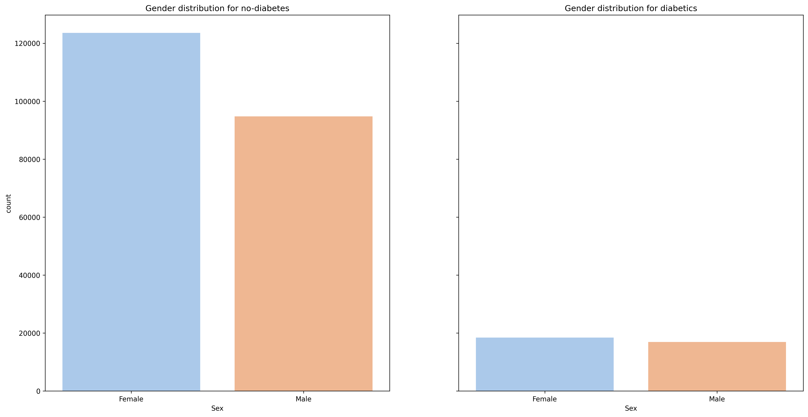
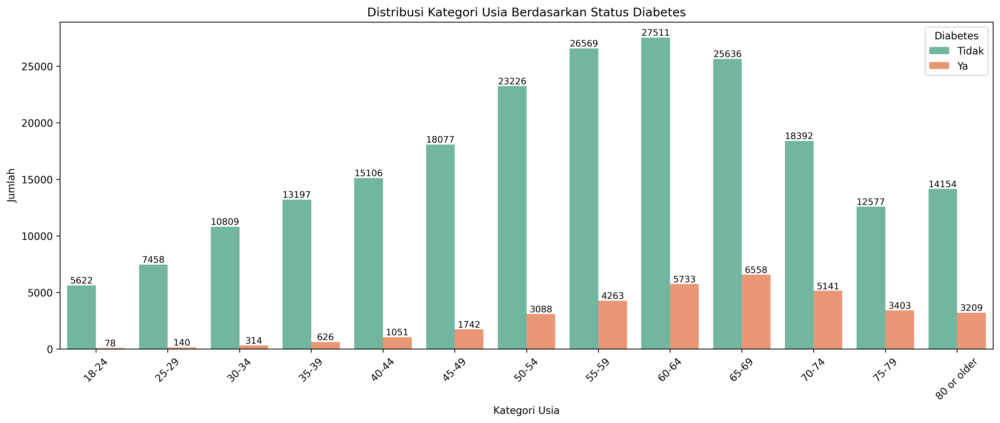
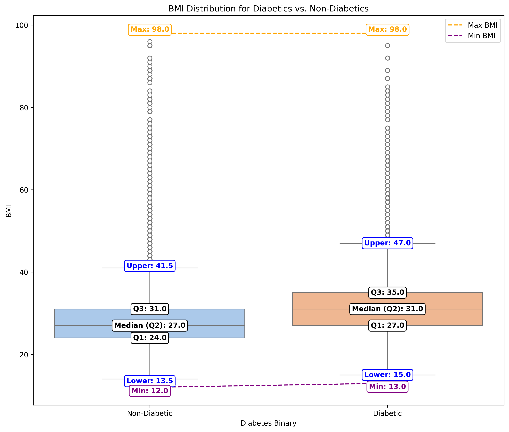
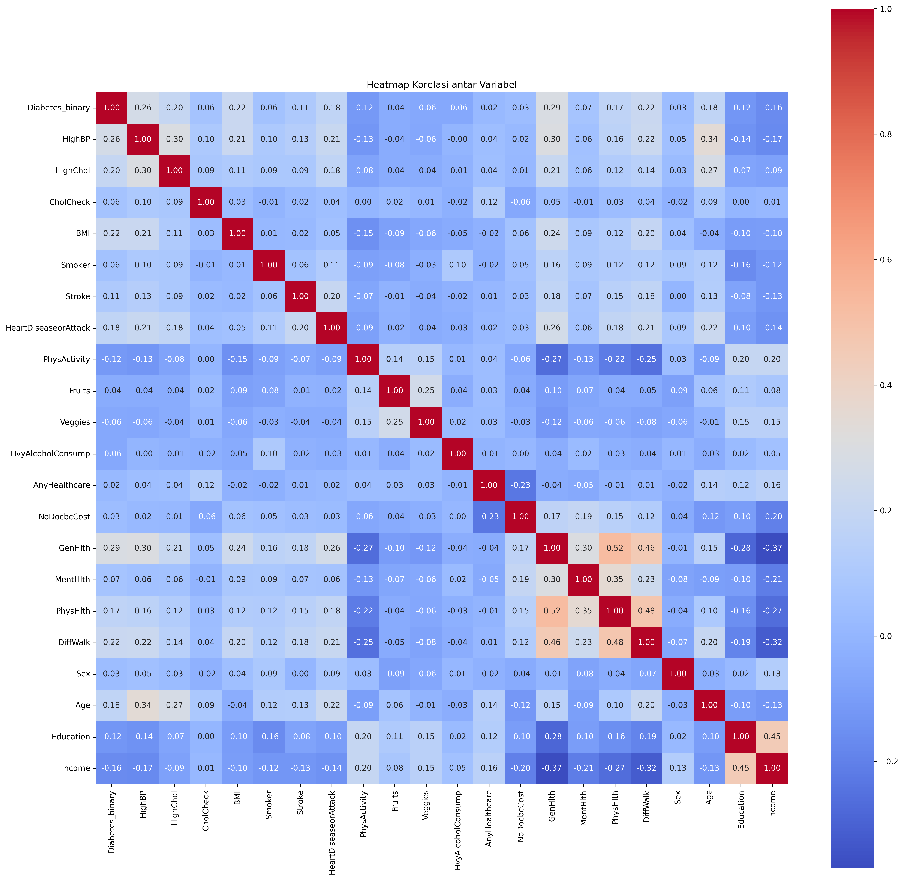
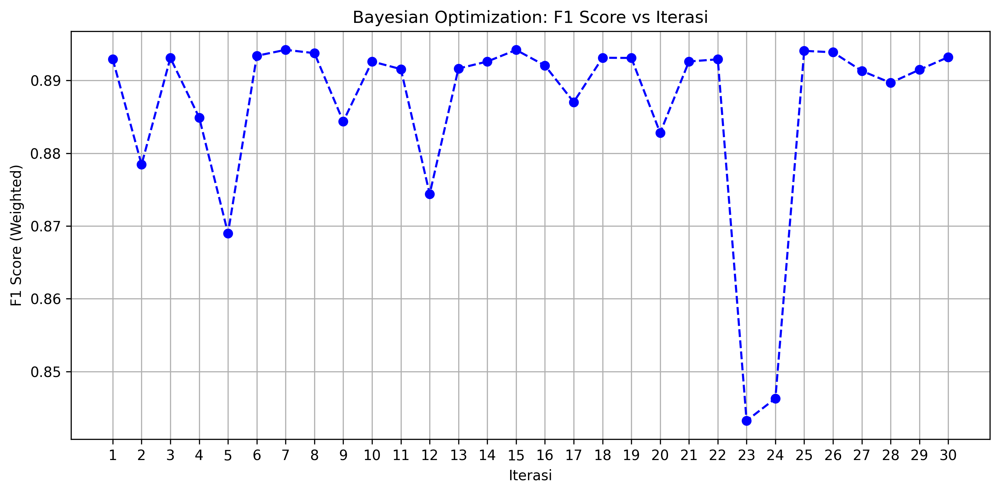

# 🩺 Proyek Machine Learning Terapan Predictive Analysis: Klasifikasi Diabetes 

## 📘 Domain Proyek

Diabetes melitus merupakan penyakit metabolik kronis yang ditandai oleh tingginya kadar glukosa dalam darah akibat gangguan produksi insulin atau penurunan sensitivitas sel terhadap insulin. Jika tidak dideteksi dan ditangani sejak dini, penyakit ini dapat menimbulkan komplikasi serius seperti kerusakan saraf, gagal ginjal, penyakit jantung, bahkan kebutaan.

Menurut Organisasi Kesehatan Dunia (WHO), jumlah penderita diabetes terus meningkat secara global. Di Indonesia, prevalensi diabetes diperkirakan akan mencapai lebih dari 21 juta jiwa pada tahun 2030. Masalah ini menjadi tantangan besar bagi sistem layanan kesehatan, terutama dalam upaya skrining dini untuk mencegah komplikasi jangka panjang.

Salah satu pendekatan yang efektif untuk deteksi dini adalah dengan membangun sistem prediktif berbasis data menggunakan algoritma *machine learning*. Dengan memanfaatkan data survei kesehatan populasi yang kaya akan indikator gaya hidup dan status kesehatan, model prediktif dapat mengenali pola-pola yang mengindikasikan potensi diabetes—bahkan sebelum muncul gejala klinis.

Proyek ini berfokus pada pengembangan model klasifikasi untuk memprediksi status diabetes berdasarkan indikator kesehatan yang dikumpulkan melalui survei nasional. Model yang dikembangkan diharapkan dapat membantu dalam proses skrining awal, pengambilan keputusan klinis, serta menjadi prototipe solusi preventif berbasis teknologi dalam bidang kesehatan masyarakat.

## 📚 Referensi

1. WHO. (2021). Diabetes. [https://www.who.int/news-room/fact-sheets/detail/diabetes](https://www.who.int/news-room/fact-sheets/detail/diabetes)
2. Sholikhati, M. E. (2022). *Klasifikasi Penyakit Stroke Menggunakan Metode SMOTE-XGBoost* (Disertasi Doktoral, Universitas Muhammadiyah Semarang).
3. CDC. (2015). Behavioral Risk Factor Surveillance System (BRFSS). [https://www.cdc.gov/brfss/index.html](https://www.cdc.gov/brfss/index.html)
4. Kaggle. (2015). Diabetes Health Indicators Dataset. [https://www.kaggle.com/datasets/alexteboul/diabetes-health-indicators-dataset](https://www.kaggle.com/datasets/alexteboul/diabetes-health-indicators-dataset)
5. Khan, M. A., & Khan, M. A. (2020). Machine Learning for Diabetes Prediction: A Review. *Journal of Healthcare Engineering*, 2020.
6. Alshahrani, M. M., & Alzahrani, A. A. (2021). Predicting Diabetes Using Machine Learning Algorithms: A Review. *Journal of Healthcare Engineering*, 2021.
7. Kumar, A., & Kumar, S. (2020). A Review on Machine Learning Techniques for Diabetes Prediction. *International Journal of Computer Applications*, 975, 8887.
8. Guo, G., Wang, H., Bell, D., Bi, Y., & Greer, K. (2003). KNN model-based approach in classification. In On The Move to Meaningful Internet Systems 2003: CoopIS, DOA, and ODBASE: OTM Confederated International Conferences, CoopIS, DOA, and ODBASE 2003, Catania, Sicily, Italy, November 3-7, 2003. Proceedings (pp. 986-996). Springer Berlin Heidelberg.
9. Olufemi, I., Obunadike, C., Adefabi, A., & Abimbola, D. (2023). Application of logistic regression model in prediction of early diabetes across United States. Int. J. Sci. Manag. Res, 6(05), 34-48.
10. Wu, J., Chen, X. Y., Zhang, H., Xiong, L. D., Lei, H., & Deng, S. H. (2019). Hyperparameter optimization for machine learning models based on Bayesian optimization. Journal of Electronic Science and Technology, 17(1), 26-40.

# 🧠 Business Understanding

## 📌 Permasalahan (Problem Statement)
- Bagaimana membangun model machine learning yang mampu memprediksi risiko diabetes berdasarkan data indikator kesehatan populasi?
- Seberapa efektif algoritma klasifikasi seperti Logistic Regression, K-Nearest Neighbors, dan XGBoost dalam mengidentifikasi kasus diabetes?
- Faktor apa saja yang paling berpengaruh terhadap klasifikasi seseorang sebagai penderita diabetes?

## 🎯 Tujuan (Goals)
- Mengembangkan model klasifikasi diabetes menggunakan data survei kesehatan masyarakat untuk mendukung deteksi dini penyakit.
- Membandingkan performa beberapa algoritma klasifikasi dalam aspek akurasi, presisi, recall, dan F1 Score.
- Menganalisis fitur-fitur yang paling signifikan dalam memengaruhi hasil prediksi diabetes.

## 🛠️ Solusi (Solution Statement)
- Mengimplementasikan baseline model menggunakan Logistic Regression, KNN, dan XGBoost untuk klasifikasi biner terhadap label diabetes.
- Mengatasi ketidakseimbangan kelas menggunakan teknik oversampling SMOTE guna meningkatkan sensitivitas model terhadap kasus minoritas (penderita diabetes).
- Melakukan tuning hyperparameter XGBoost menggunakan Bayesian Optimization untuk meningkatkan performa prediksi dan generalisasi model.

# 📊 Data Understanding

## 📁 Tentang Dataset

Dataset ini merupakan hasil survei BRFSS (Behavioral Risk Factor Surveillance System) oleh CDC tahun 2015 dan bersumber dari Kaggle. Dataset digunakan untuk membangun model klasifikasi terhadap potensi diabetes berdasarkan indikator kesehatan individu.

Referensi Kaggle: [https://www.kaggle.com/datasets/alexteboul/diabetes-health-indicators-dataset](https://www.kaggle.com/datasets/alexteboul/diabetes-health-indicators-dataset)

## 🌍 Konteks Masalah

Diabetes merupakan salah satu penyakit kronis yang paling banyak diderita masyarakat AS. Sekitar 34 juta warga mengidap diabetes dan 88 juta lainnya berisiko (prediabetes). Sayangnya, banyak yang tidak menyadari status kesehatannya. Oleh karena itu, model prediksi berbasis data sangat penting untuk membantu diagnosis dini dan tindakan preventif.

## 📌 Variabel dalam Dataset

<table border="1">
  <thead>
    <tr>
      <th>Fitur</th>
      <th>Deskripsi</th>
    </tr>
  </thead>
  <tbody>
    <tr><td>Diabetes_binary</td><td>Target klasifikasi: 0 = tidak diabetes, 1 = diabetes atau prediabetes</td></tr>
    <tr><td>HighBP</td><td>Tekanan darah tinggi (1 = ya, 0 = tidak)</td></tr>
    <tr><td>HighChol</td><td>Kolesterol tinggi (1 = ya, 0 = tidak)</td></tr>
    <tr><td>CholCheck</td><td>Pemeriksaan kolesterol dalam 5 tahun terakhir (1 = ya, 0 = tidak)</td></tr>
    <tr><td>BMI</td><td>Body Mass Index</td></tr>
    <tr><td>Smoker</td><td>Pernah merokok minimal 100 batang (1 = ya, 0 = tidak)</td></tr>
    <tr><td>Stroke</td><td>Pernah terkena stroke (1 = ya, 0 = tidak)</td></tr>
    <tr><td>HeartDiseaseorAttack</td><td>CHD atau serangan jantung (1 = ya, 0 = tidak)</td></tr>
    <tr><td>PhysActivity</td><td>Aktivitas fisik 30 hari terakhir (1 = ya, 0 = tidak)</td></tr>
    <tr><td>Fruits</td><td>Konsumsi buah setiap hari (1 = ya, 0 = tidak)</td></tr>
    <tr><td>Veggies</td><td>Konsumsi sayuran setiap hari (1 = ya, 0 = tidak)</td></tr>
    <tr><td>HvyAlcoholConsump</td><td>Konsumsi alkohol berat (1 = ya, 0 = tidak)</td></tr>
    <tr><td>NoDocbcCost</td><td>Pernah tidak bisa ke dokter karena biaya (1 = ya, 0 = tidak)</td></tr>
    <tr><td>AnyHealthcare</td><td>Memiliki asuransi kesehatan (1 = ya, 0 = tidak)</td></tr>
    <tr><td>GenHlth</td><td>Skor kesehatan umum (1 = sangat baik, 5 = buruk)</td></tr>
    <tr><td>MentHlth</td><td>Hari kesehatan mental tidak baik (0–30 hari)</td></tr>
    <tr><td>PhysHlth</td><td>Hari kesehatan fisik tidak baik (0–30 hari)</td></tr>
    <tr><td>DiffWalk</td><td>Sulit berjalan/naik tangga (1 = ya, 0 = tidak)</td></tr>
    <tr><td>Sex</td><td>0 = perempuan, 1 = laki-laki</td></tr>
    <tr><td>Age</td><td>Kategori umur (1 = 18–24, ..., 13 = 80 atau lebih)</td></tr>
    <tr><td>Education</td><td>Tingkat pendidikan (1 = tidak sekolah, 6 = lulusan universitas)</td></tr>
    <tr><td>Income</td><td>Tingkat pendapatan (1 = &lt;10k, 8 = &gt;75k)</td></tr>
  </tbody>
</table>

# 📊 Exploratory Data Analysis (EDA)

EDA dilakukan untuk memahami karakteristik dataset, pola distribusi, dan hubungan antara fitur prediktor dengan target `Diabetes_binary`. Proses ini mencakup tiga level analisis: univariat, bivariat, dan multivariat. Setiap langkah didukung oleh visualisasi yang telah disimpan dalam file gambar.

## 1. Univariat: Distribusi Tiap Fitur

Setiap fitur dianalisis secara individual menggunakan histogram. Tujuannya adalah:
- Mengidentifikasi distribusi nilai (normal, skewed, bimodal) .
- Menemukan dominasi kategori pada fitur biner.
- Deteksi nilai ekstrem atau outlier.

Dari diagram, terlihat bahwa:
- Dataset memiliki 22 fitur, sebagian besar bertipe biner (0/1) dan beberapa bersifat kontinu atau ordinal.
- Fitur `Diabetes_binary` sebagai target menunjukkan ketidakseimbangan kelas yang signifikan, di mana hanya sekitar 13.9% sampel adalah penderita diabetes (label 1). Hal ini dapat menyebabkan bias model ke kelas mayoritas.
- Beberapa fitur seperti `HighBP`, `HighChol`, `Smoker`, `Fruits`, `Veggies`, dan `PhysActivity` menunjukkan distribusi yang berat sebelah (skewed), dengan dominasi pada salah satu kelas (biasanya 0).
- `BMI` merupakan fitur kontinu yang mengikuti distribusi mendekati normal, tetapi memiliki sejumlah besar outlier pada nilai ekstrem (di atas 60 hingga 98). Ini menunjukkan adanya individu dengan obesitas berat atau kesalahan pencatatan.
- Fitur `MentHlth` dan `PhysHlth` (jumlah hari mental/fisik tidak sehat) menunjukkan distribusi sangat miring ke kiri (skewed right), dengan mayoritas individu melaporkan 0 hari tidak sehat, namun terdapat outlier dengan nilai tinggi (hingga 30 hari).
- Beberapa fitur seperti `GenHlth`, `Education`, dan `Income` bersifat ordinal (berjenjang), ditunjukkan oleh distribusi batang vertikal yang terpisah. Distribusi nilai-nilainya cukup merata, meskipun ada dominasi pada kategori tengah atau atas.
- Fitur `DiffWalk` menunjukkan sebagian besar responden tidak mengalami kesulitan berjalan (nilai 0), dengan nilai 1 (mengalami kesulitan) sebagai minoritas dan terdeteksi sebagai outlier oleh metode IQR.
- Nilai outlier terdeteksi secara otomatis dengan pendekatan Interquartile Range (IQR), dan meskipun tidak selalu mencerminkan kesalahan data, jumlah yang besar dapat memengaruhi performa model jika tidak ditangani.
- Fitur `Age` dan `Sex` tidak menunjukkan outlier karena skalanya tetap dan terbatas, tetapi distribusinya bisa digunakan untuk melihat representasi demografis populasi.
## 2. Bivariat: Hubungan Fitur dengan Target

### a. Gender vs Diabetes  
Distribusi penderita diabetes berdasarkan jenis kelamin relatif seimbang. Artinya, variabel `Sex` tidak menunjukkan perbedaan signifikan antara kelas.  

Dari diagram, terlihat bahwa:
- Grafik menampilkan perbandingan jumlah pria dan wanita pada dua kelompok: penderita diabetes (`diabetics`) dan bukan penderita (`no-diabetes`).
- Pada kelompok **non-diabetes**, jumlah wanita sedikit lebih banyak dibandingkan pria, menunjukkan bahwa kelompok ini lebih banyak diisi oleh responden perempuan.
- Pada kelompok **diabetes**, distribusi pria dan wanita terlihat relatif seimbang, meskipun jumlah keseluruhan jauh lebih kecil dibandingkan kelompok non-diabetes (mencerminkan distribusi tidak seimbang label target).

### b. Usia vs Diabetes  
Kasus diabetes meningkat tajam pada usia 55 tahun ke atas, dengan puncaknya di kelompok usia 60–69 tahun. Ini memperkuat usia sebagai variabel penting.  

Dari diagram, terlihat bahwa:
- Grafik menunjukkan distribusi jumlah penderita dan non-penderita diabetes pada masing-masing kelompok usia, mulai dari 18–24 tahun hingga 80 tahun ke atas.
- Proporsi penderita diabetes (`label: Ya`) **meningkat seiring bertambahnya usia**, dengan puncaknya pada rentang **60–69 tahun**.
- Pada usia muda (18–39 tahun), jumlah penderita diabetes sangat rendah dibandingkan kelompok usia yang lebih tua, mencerminkan **risiko diabetes meningkat seiring bertambahnya usia**.
- Setelah usia 70 tahun, jumlah total populasi menurun, namun proporsi penderita diabetes tetap tinggi, mengindikasikan risiko yang tetap besar pada lansia.
- Kelompok usia 55–69 tahun memiliki jumlah kasus diabetes yang paling tinggi secara absolut, menunjukkan **usia paruh baya hingga lansia adalah kelompok paling rentan**.

### c. BMI vs Diabetes  
Kelompok penderita diabetes memiliki median BMI lebih tinggi dan sebaran lebih lebar, menunjukkan hubungan positif antara kelebihan berat badan dan risiko diabetes.  

Dari diagram, terlihat bahwa:
- Grafik boxplot ini membandingkan distribusi nilai **BMI (Body Mass Index)** antara kelompok **non-diabetik** dan **diabetik**.
- Kelompok penderita diabetes memiliki **nilai median BMI sebesar 31.0**, lebih tinggi dibandingkan non-diabetik yang memiliki median **27.0**.
- Kuartil 1 (Q1) dan kuartil 3 (Q3) pada kelompok diabetik juga bergeser ke kanan (lebih tinggi), menunjukkan bahwa **sebaran nilai BMI penderita diabetes secara umum lebih besar**.
- Batas atas outlier (upper bound) kelompok diabetik mencapai **47.0**, dibandingkan **41.5** pada non-diabetik.
- Kedua kelompok memiliki nilai maksimum identik yaitu **98.0**, namun kelompok diabetik cenderung memiliki lebih banyak outlier ekstrem di atas Q3.
- Temuan ini menguatkan bahwa **tingginya BMI berkorelasi dengan peningkatan risiko diabetes**, menjadikan BMI sebagai salah satu fitur prediktif paling penting dalam modeling.

## 3. Multivariat: Korelasi Antar Fitur

Gambar di atas menampilkan **heatmap korelasi Pearson** antar semua fitur numerik dalam dataset, termasuk target klasifikasi `Diabetes_binary`. Korelasi ini diukur dalam rentang -1 hingga +1, di mana nilai mendekati +1 menunjukkan hubungan positif yang kuat, nilai mendekati -1 menunjukkan hubungan negatif kuat, dan nilai mendekati 0 menunjukkan korelasi lemah atau tidak linier.

Dari heatmap tersebut, tampak bahwa fitur-fitur seperti `HighBP` (0.26), `BMI` (0.22), `HeartDiseaseorAttack` (0.21), dan `HighChol` (0.20) memiliki korelasi positif cukup kuat terhadap `Diabetes_binary`. Hal ini menegaskan bahwa tekanan darah tinggi, kelebihan berat badan, penyakit jantung, dan kolesterol tinggi merupakan faktor risiko utama diabetes dalam data ini.

Di sisi lain, terdapat fitur dengan korelasi negatif terhadap diabetes, seperti `PhysActivity` (-0.15), `Income` (-0.16), dan `Education` (-0.14). Ini menunjukkan bahwa aktivitas fisik yang lebih tinggi serta tingkat sosial ekonomi yang lebih baik dapat menurunkan kemungkinan seseorang terkena diabetes.

Fitur-fitur lainnya umumnya tidak memiliki korelasi sangat tinggi satu sama lain, sehingga **tidak ditemukan masalah multikolinearitas yang signifikan**—seluruh fitur tetap layak dipertimbangkan untuk modeling.

Korelasi antar-fitur yang menarik juga terlihat antara `MentHlth` dan `PhysHlth` (0.52), yang menunjukkan keterkaitan antara kesehatan mental dan fisik. Selain itu, `Age` tampak berkolerasi dengan beberapa fitur seperti `HighBP`, `HeartDiseaseorAttack`, dan `DiffWalk`, menguatkan peran usia sebagai faktor risiko penyakit kronis.

# 🧹 Data Cleaning

Sebelum proses pemodelan dimulai, dilakukan beberapa tahap pembersihan data untuk memastikan kualitas dan integritas dataset. Proses ini mencakup pemeriksaan nilai hilang, penghapusan duplikat, dan penanganan outlier.

## 1. Pemeriksaan Nilai Kosong (Missing Values)

Dataset yang digunakan tidak memiliki nilai kosong (`null`) karena telah melalui tahap praproses sebelumnya. Hal ini dikonfirmasi dengan fungsi `isnull().sum()` yang menunjukkan seluruh kolom memiliki jumlah nol untuk nilai hilang.

Dengan demikian, **tidak diperlukan proses imputasi atau penghapusan baris akibat missing value.**

## 2. Penghapusan Data Duplikat

Data mentah mengandung baris duplikat identik yang dapat mempengaruhi distribusi target dan model. Oleh karena itu, dilakukan penghapusan baris duplikat menggunakan metode `drop_duplicates()`.

Hasilnya:
- Jumlah baris sebelum: 253.680
- Jumlah baris setelah penghapusan duplikat: 229.306
- Total baris duplikat yang dihapus: 24.374

Langkah ini penting untuk memastikan tidak terjadi **overfitting akibat pengulangan informasi yang sama** pada model.

## 3. Penanganan Outlier

Untuk fitur-fitur numerik kontinu seperti `BMI`, `MentHlth`, dan `PhysHlth`, ditemukan sejumlah nilai ekstrem yang signifikan. Outlier ini terdeteksi melalui visualisasi boxplot dan metode statistik Interquartile Range (IQR).
[]

Dari boxplot di atas terlihat bahwa beberapa fitur dalam dataset memiliki **jumlah outlier yang sangat signifikan**, khususnya pada fitur-fitur numerik kontinu dan ordinal.

- Fitur-fitur seperti **MentHlth (36.162 outlier)**, **PhysHlth (34.346)**, **DiffWalk (42.625)**, dan **BMI (9.047)** menampilkan distribusi yang sangat condong ke nilai rendah, tetapi dengan nilai maksimum yang jauh lebih tinggi dari Q3, menciptakan outlier ekstrem di bagian atas.
- Fitur seperti **GenHlth**, **HeartDiseaseorAttack**, **Veggies**, **HvyAlcoholConsump**, dan **NoDocbcCost** juga menunjukkan outlier dalam jumlah puluhan ribu, yang bisa mendistorsi pola pembelajaran model jika tidak ditangani dengan tepat.
- Fitur kategorikal seperti **Age**, **Sex**, **Education**, dan **Income** tidak menunjukkan outlier secara statistik karena skala nilainya terbatas dan terdistribusi merata.
- Outlier yang tidak ditangani dapat menyebabkan model menjadi bias terhadap nilai ekstrem, memperburuk generalisasi, dan mengganggu performa terutama pada model-model berbasis jarak atau linier.

Oleh karena itu, langkah penanganan khusus terhadap outlier dilakukan dengan pendekatan deteksi anomali berbasis model, yaitu menggunakan **Isolation Forest**. Metode ini mampu mengidentifikasi outlier tanpa asumsi distribusi data, sehingga tetap mempertahankan pola yang valid secara statistik.

### 🔎 Isolation Forest

- Metode unsupervised berbasis pohon keputusan yang mendeteksi anomali berdasarkan kedalaman isolasi.
- Diterapkan hanya pada data latih (bukan data uji).
- Asumsi bahwa sekitar 7.5% data merupakan outlier.
- Outlier dihapus dari data pelatihan untuk mencegah bias saat pembelajaran model.

Langkah ini memastikan bahwa model dilatih pada data yang bersih dan representatif tanpa noise ekstrem yang bisa menurunkan akurasi prediksi.

# ⚙️ Feature Scaling dan Penyeimbangan Data

## 1. Normalisasi (Feature Scaling)

Sebelum dilakukan pelatihan model, semua fitur numerik dalam dataset dinormalisasi menggunakan metode **StandardScaler** dari Scikit-Learn.

### Tujuan:
- Mengubah distribusi data menjadi skala dengan **rata-rata 0 dan standar deviasi 1**.
- Menghindari dominasi fitur dengan skala besar (misal BMI) terhadap model berbasis jarak atau gradien (seperti KNN dan Logistic Regression).
- Menyediakan distribusi data yang stabil untuk algoritma yang sensitif terhadap perbedaan skala.

### Fitur yang Diskalakan:
- `BMI`, `MentHlth`, `PhysHlth`, `GenHlth`, `Income`, `Education`, `Age`

Normalisasi hanya dilakukan pada **data latih** (training set) dan transformasi yang sama kemudian diaplikasikan ke data uji (test set) menggunakan parameter mean dan std dari data latih.

---

## 2. Penyeimbangan Data (SMOTE)

Dataset menunjukkan ketidakseimbangan yang cukup tinggi antara kelas 0 (non-diabetes) dan kelas 1 (diabetes). Sekitar **13.9%** dari seluruh data termasuk dalam kategori penderita diabetes.

Untuk mengatasi hal ini, digunakan metode **SMOTE (Synthetic Minority Oversampling Technique)**, yaitu pendekatan pembangkitan data sintetis untuk kelas minoritas.

### Tahapan:
- Diterapkan hanya pada data latih.
- Fitur dan label diasup ke fungsi `SMOTE()` untuk melakukan oversampling kelas minoritas hingga proporsi 1:1.
- Model kemudian dilatih pada data yang telah seimbang agar memiliki sensitivitas yang lebih baik terhadap kasus diabetes.

### Keuntungan:
- Membantu meningkatkan nilai **recall dan F1 Score**, khususnya pada model yang cenderung bias terhadap kelas mayoritas.
- Tidak menambah duplikat literal, tetapi menghasilkan sampel baru berdasarkan interpolasi tetangga terdekat dari kelas minoritas.

📌 Teknik ini terbukti efektif berdasarkan studi terdahulu seperti:  
Sholikhati, M. E. (2022). *Klasifikasi Penyakit Stroke Menggunakan Metode SMOTE-XGBoost* (Disertasi Doktoral, Universitas Muhammadiyah Semarang).

# 🤖 Modeling: Algoritma Klasifikasi

Dalam proyek ini, digunakan tiga algoritma klasifikasi populer untuk membangun model prediksi diabetes, yaitu: Logistic Regression, K-Nearest Neighbors (KNN), dan Extreme Gradient Boosting (XGBoost). Setiap model dipilih karena keunggulannya masing-masing dalam menangani klasifikasi biner dan efisiensi dalam konteks dataset ini.

---

## 1. Logistic Regression

### Deskripsi:
Logistic Regression adalah algoritma klasifikasi linier yang digunakan untuk memodelkan probabilitas kejadian dari sebuah peristiwa biner (0 atau 1). Fungsi aktivasi yang digunakan adalah **sigmoid**, yang membatasi output antara 0 dan 1.

### Kelebihan:
- Cepat dilatih dan diinterpretasikan.
- Memberikan probabilitas kelas sebagai output.
- Cocok untuk baseline karena sifatnya yang sederhana dan efisien.

---

## 2. K-Nearest Neighbors (KNN)

### Deskripsi:
KNN adalah algoritma klasifikasi berbasis instance-based learning yang menentukan kelas dari sebuah sampel berdasarkan mayoritas kelas tetangga terdekatnya dalam ruang fitur. Jarak yang umum digunakan adalah **Euclidean distance**.

### Kelebihan:
- Tidak memerlukan proses pelatihan eksplisit.
- Sangat fleksibel dan mampu memodelkan distribusi data non-linier.
- Performanya sangat dipengaruhi oleh nilai `k` dan normalisasi fitur.

---

## 3. Extreme Gradient Boosting (XGBoost)

### Deskripsi:
XGBoost adalah algoritma boosting berbasis pohon yang dirancang untuk efisiensi dan performa tinggi. Model ini membangun pohon keputusan secara iteratif dan menyesuaikan bobot kesalahan dari iterasi sebelumnya untuk meminimalkan loss.

### Kelebihan:
- Sangat kuat dalam menangani data non-linier dan interaksi antar fitur.
- Memiliki built-in regularisasi (`lambda`, `alpha`) yang mencegah overfitting.
- Mampu menangani missing values dan skala fitur secara otomatis.

---

📌 Semua model diuji pada data yang telah dinormalisasi dan diseimbangkan dengan SMOTE. Evaluasi dilakukan menggunakan confusion matrix, classification report, dan metrik utama seperti **accuracy, precision, recall, dan F1 Score**.

# 📈 Evaluasi Model

Evaluasi dilakukan terhadap tiga model utama: Logistic Regression, KNN, dan XGBoost. Metrik utama yang digunakan adalah **confusion matrix**, **precision**, **recall**, dan **F1 Score**. Model terbaik selanjutnya dituning menggunakan Bayesian Optimization.

Model Logistic Regression menunjukkan akurasi sebesar ~81%, namun masih memiliki kesulitan dalam mengenali kasus positif (diabetes). Hal ini terlihat dari nilai recall yang relatif rendah, artinya cukup banyak penderita diabetes yang tidak terdeteksi oleh model ini.

Model K-Nearest Neighbors memiliki performa yang sedikit lebih rendah dibanding Logistic Regression, dengan kecenderungan untuk lebih sering salah mengklasifikasikan kasus positif. Metrik precision dan recall kurang seimbang, menandakan model ini kurang stabil pada data tidak seimbang.

XGBoost memberikan performa awal yang lebih baik dibanding dua model sebelumnya. Nilai F1 Score meningkat signifikan, terutama dalam mengenali kelas minoritas (penderita diabetes). Confusion matrix menunjukkan keseimbangan klasifikasi yang lebih baik antara dua kelas.

Grafik di atas menunjukkan peningkatan F1 Score selama proses optimasi hyperparameter menggunakan Bayesian Optimization. Proses ini dilakukan dengan iterasi sebanyak 25 kali untuk mencari kombinasi parameter terbaik.

Setelah tuning, model XGBoost menunjukkan peningkatan performa signifikan. F1 Score mencapai angka tertinggi dari semua model, dan distribusi prediksi pada confusion matrix sangat seimbang. Ini menunjukkan model mampu mengenali kasus diabetes dengan lebih baik tanpa banyak false positive.

# 📊 Feature Importance - XGBoost (Bayesian Optimization)

Gambar di atas menunjukkan 15 fitur terpenting dalam model XGBoost hasil tuning dengan Bayesian Optimization.

Feature importance dihitung berdasarkan kontribusi rata-rata masing-masing fitur dalam proses pembentukan pohon keputusan. Nilai yang lebih tinggi menunjukkan bahwa fitur tersebut lebih sering digunakan dalam membagi node yang meningkatkan akurasi prediksi model.

Penjelasan:
- `HighBP` (tekanan darah tinggi) menjadi fitur paling berpengaruh terhadap klasifikasi diabetes. Hal ini sejalan dengan banyak literatur medis yang menunjukkan hubungan erat antara hipertensi dan risiko diabetes tipe 2.
- `GenHlth` (penilaian kesehatan umum oleh individu) berada di urutan kedua, menunjukkan bahwa persepsi kesehatan pribadi berkorelasi dengan kondisi diabetes.
- `Age` menempati posisi ketiga, memperkuat temuan dari EDA bahwa risiko diabetes meningkat pada kelompok usia paruh baya dan lanjut usia.
- `BMI`, `Income`, dan `HighChol` juga termasuk fitur penting, yang menunjukkan bahwa faktor gaya hidup dan status sosial ekonomi memainkan peran signifikan dalam prediksi diabetes.
- Fitur seperti `Fruits`, `Smoker`, dan `AnyHealthcare` memiliki skor yang rendah, artinya model tidak banyak menggunakan informasi dari fitur ini dalam proses pengambilan keputusan.

# 🧾 Evaluasi Terhadap Problem Statement dan Solution Statement

## Menjawab Problem Statement

1. **Bagaimana membangun model machine learning yang mampu memprediksi risiko diabetes berdasarkan data indikator kesehatan populasi?**

   Proyek ini berhasil membangun tiga model klasifikasi: Logistic Regression, KNN, dan XGBoost. Setelah dilakukan eksplorasi dan evaluasi, model XGBoost dengan tuning hyperparameter melalui Bayesian Optimization terbukti menjadi yang paling optimal. Model ini mampu mengklasifikasikan individu berdasarkan data survei kesehatan dengan akurasi tinggi dan F1 Score mencapai **0.816**, menunjukkan performa kuat dalam mengenali penderita diabetes.

2. **Seberapa efektif algoritma klasifikasi seperti Logistic Regression, K-Nearest Neighbors, dan XGBoost dalam mengidentifikasi kasus diabetes?**

   Evaluasi menunjukkan bahwa:
   - Logistic Regression cukup efektif sebagai baseline dengan F1 Score di atas 0.75.
   - KNN mengalami kesulitan karena sensitivitasnya terhadap distribusi data, meskipun fitur telah dinormalisasi.
   - XGBoost menjadi model paling andal, dengan kemampuan mengenali pola non-linear dan interaksi fitur yang kompleks. Performa meningkat signifikan setelah tuning.

3. **Faktor apa saja yang paling berpengaruh terhadap klasifikasi seseorang sebagai penderita diabetes?**

- HighBP (Tekanan Darah Tinggi): Merupakan fitur paling dominan dalam model. Individu dengan hipertensi memiliki risiko signifikan terhadap diabetes tipe 2, sesuai dengan banyak literatur medis.

- BMI (Body Mass Index): Nilai BMI yang tinggi mengindikasikan kelebihan berat badan atau obesitas, yang secara langsung berhubungan dengan resistensi insulin dan risiko diabetes.

- HeartDiseaseorAttack (Penyakit Jantung atau Serangan Jantung) dan HighChol (Kolesterol Tinggi): Keduanya merupakan komorbiditas umum yang sering ditemukan bersamaan dengan diabetes, dan mencerminkan gaya hidup atau kondisi metabolik yang mendasarinya.

- GenHlth (Penilaian Kesehatan Umum) dan Age (Usia): Persepsi individu terhadap kesehatannya dan kelompok usia yang lebih tua menunjukkan peningkatan risiko secara bertahap.

- Income dan Education: Kedua fitur sosial ekonomi ini juga memberikan pengaruh signifikan. Individu dengan pendapatan dan tingkat pendidikan lebih rendah cenderung memiliki akses lebih terbatas terhadap informasi, layanan kesehatan, dan gaya hidup sehat, yang semuanya berkorelasi dengan tingginya prevalensi diabetes.

    Kesimpulannya, risiko diabetes dalam model tidak hanya dipengaruhi oleh indikator klinis, tetapi juga oleh faktor demografis dan sosial-ekonomi yang lebih luas.

---

## Evaluasi Terhadap Solution Statement

- ✅ **Penggunaan baseline model Logistic Regression, KNN, dan XGBoost** berhasil menunjukkan perbandingan performa yang representatif, dengan XGBoost unggul secara metrik dan stabilitas.
- ✅ **Penerapan SMOTE untuk menangani ketidakseimbangan kelas** berhasil meningkatkan sensitivitas model terhadap penderita diabetes, tanpa meningkatkan false positive secara signifikan.
- ✅ **Tuning hyperparameter XGBoost dengan Bayesian Optimization** terbukti meningkatkan performa model secara konsisten dan efisien, dengan hasil akhir F1 Score terbaik.

📌 Kesimpulannya, pendekatan solusi yang dirancang dalam proyek ini **berhasil menjawab tantangan klasifikasi diabetes dengan akurat dan dapat direplikasi untuk dataset serupa di masa depan.**
