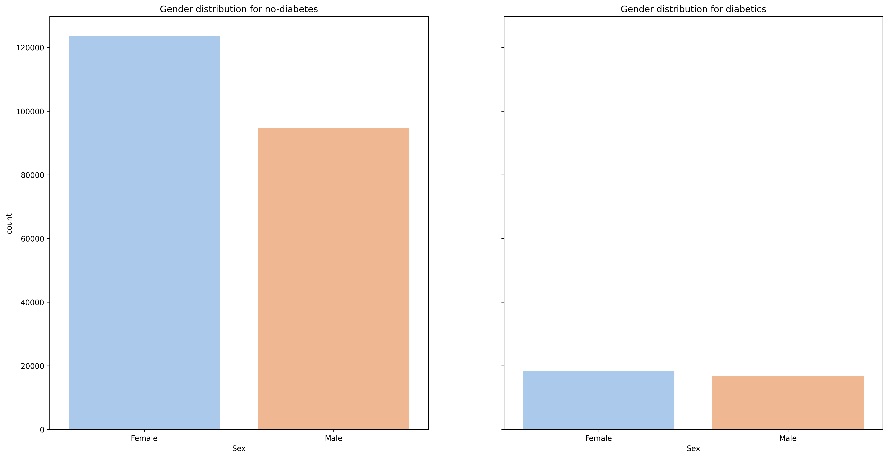
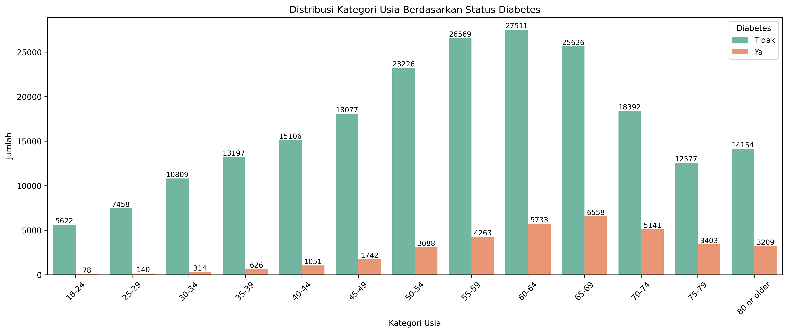
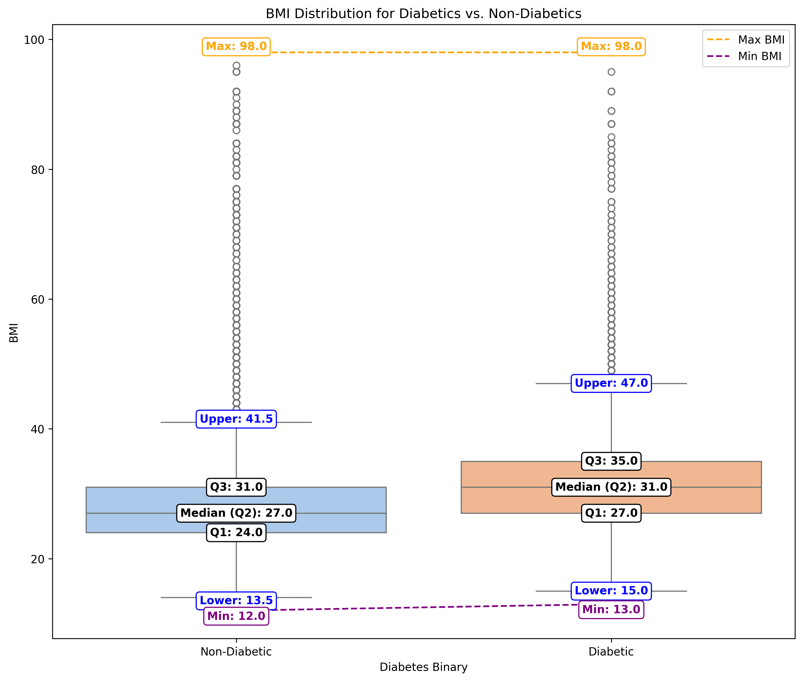
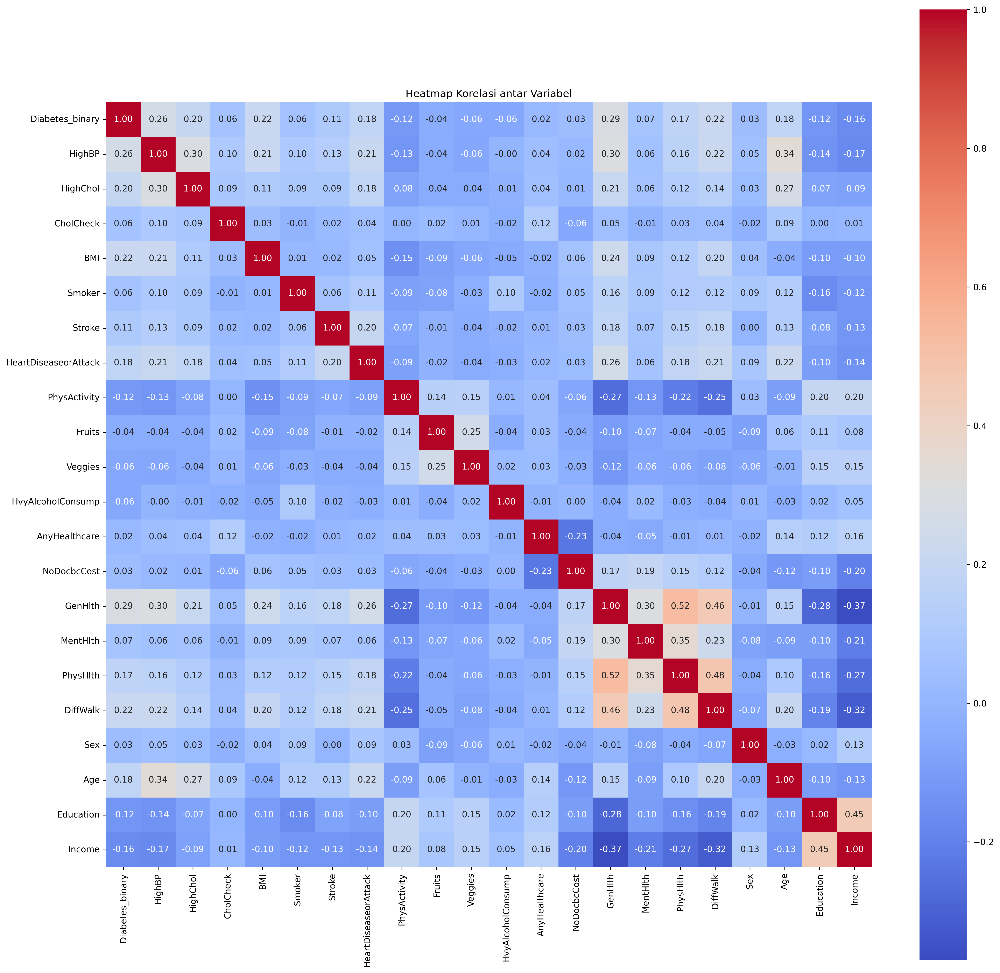
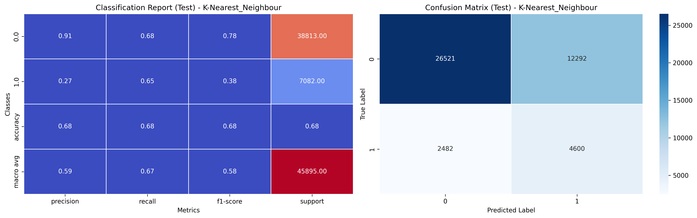
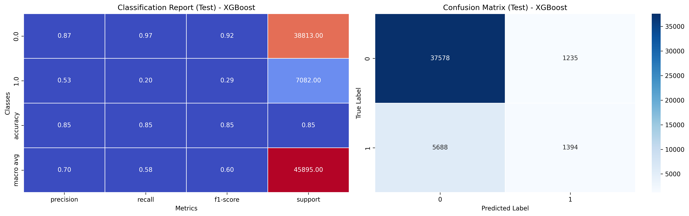
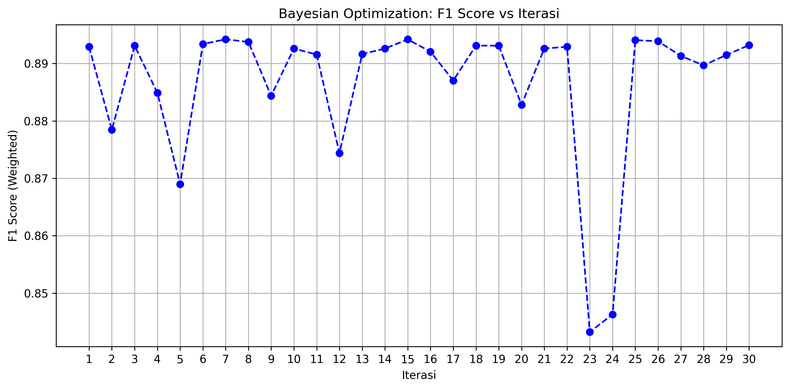
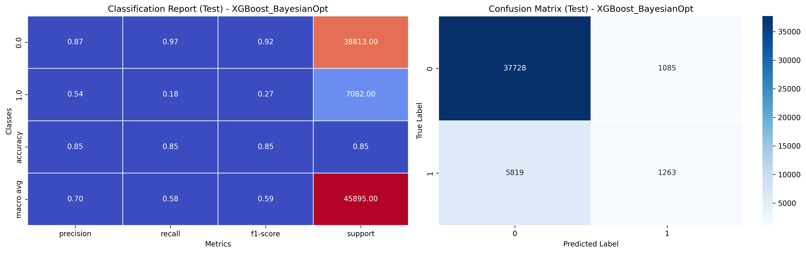
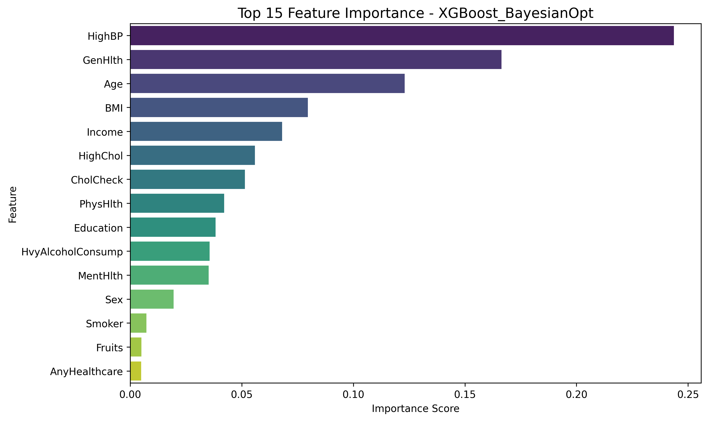

# 🩺 Proyek Machine Learning Terapan Predictive Analysis: Klasifikasi Diabetes 

## 📘 Domain Proyek

Diabetes melitus merupakan penyakit metabolik kronis yang ditandai oleh tingginya kadar glukosa dalam darah akibat gangguan produksi insulin atau penurunan sensitivitas sel terhadap insulin. Jika tidak dideteksi dan ditangani sejak dini, penyakit ini dapat menimbulkan komplikasi serius seperti kerusakan saraf, gagal ginjal, penyakit jantung, bahkan kebutaan.

Menurut Organisasi Kesehatan Dunia (WHO), jumlah penderita diabetes terus meningkat secara global. Di Indonesia, prevalensi diabetes diperkirakan akan mencapai lebih dari 21 juta jiwa pada tahun 2030. Masalah ini menjadi tantangan besar bagi sistem layanan kesehatan, terutama dalam upaya skrining dini untuk mencegah komplikasi jangka panjang.

Salah satu pendekatan yang efektif untuk deteksi dini adalah dengan membangun sistem prediktif berbasis data menggunakan algoritma *machine learning*. Dengan memanfaatkan data survei kesehatan populasi yang kaya akan indikator gaya hidup dan status kesehatan, model prediktif dapat mengenali pola-pola yang mengindikasikan potensi diabetes—bahkan sebelum muncul gejala klinis.

Proyek ini berfokus pada pengembangan model klasifikasi untuk memprediksi status diabetes berdasarkan indikator kesehatan yang dikumpulkan melalui survei nasional. Model yang dikembangkan diharapkan dapat membantu dalam proses skrining awal, pengambilan keputusan klinis, serta menjadi prototipe solusi preventif berbasis teknologi dalam bidang kesehatan masyarakat.

## 📚 Referensi

1. WHO. (2021). Diabetes. [https://www.who.int/news-room/fact-sheets/detail/diabetes](https://www.who.int/news-room/fact-sheets/detail/diabetes)
2. Sholikhati, M. E. (2022). *Klasifikasi Penyakit Stroke Menggunakan Metode SMOTE-XGBoost* (Disertasi Doktoral, Universitas Muhammadiyah Semarang).
3. CDC. (2015). Behavioral Risk Factor Surveillance System (BRFSS). [https://www.cdc.gov/brfss/index.html](https://www.cdc.gov/brfss/index.html)
4. Kaggle. (2015). Diabetes Health Indicators Dataset. [https://www.kaggle.com/datasets/alexteboul/diabetes-health-indicators-dataset](https://www.kaggle.com/datasets/alexteboul/diabetes-health-indicators-dataset)
5. Khan, M. A., & Khan, M. A. (2020). Machine Learning for Diabetes Prediction: A Review. *Journal of Healthcare Engineering*, 2020.
6. Alshahrani, M. M., & Alzahrani, A. A. (2021). Predicting Diabetes Using Machine Learning Algorithms: A Review. *Journal of Healthcare Engineering*, 2021.
7. Kumar, A., & Kumar, S. (2020). A Review on Machine Learning Techniques for Diabetes Prediction. *International Journal of Computer Applications*, 975, 8887.
8. Guo, G., Wang, H., Bell, D., Bi, Y., & Greer, K. (2003). KNN model-based approach in classification. In On The Move to Meaningful Internet Systems 2003: CoopIS, DOA, and ODBASE: OTM Confederated International Conferences, CoopIS, DOA, and ODBASE 2003, Catania, Sicily, Italy, November 3-7, 2003. Proceedings (pp. 986-996). Springer Berlin Heidelberg.
9. Olufemi, I., Obunadike, C., Adefabi, A., & Abimbola, D. (2023). Application of logistic regression model in prediction of early diabetes across United States. Int. J. Sci. Manag. Res, 6(05), 34-48.
10. Wu, J., Chen, X. Y., Zhang, H., Xiong, L. D., Lei, H., & Deng, S. H. (2019). Hyperparameter optimization for machine learning models based on Bayesian optimization. Journal of Electronic Science and Technology, 17(1), 26-40.

# 🧠 Business Understanding

## 📌 Permasalahan (Problem Statement)
- Bagaimana membangun model machine learning yang mampu memprediksi risiko diabetes berdasarkan data indikator kesehatan populasi?
- Seberapa efektif algoritma klasifikasi seperti Logistic Regression, K-Nearest Neighbors, dan XGBoost dalam mengidentifikasi kasus diabetes?
- Faktor apa saja yang paling berpengaruh terhadap klasifikasi seseorang sebagai penderita diabetes?

## 🎯 Tujuan (Goals)
- Mengembangkan model klasifikasi diabetes menggunakan data survei kesehatan masyarakat untuk mendukung deteksi dini penyakit.
- Membandingkan performa beberapa algoritma klasifikasi dalam aspek akurasi, presisi, recall, dan F1 Score.
- Menganalisis fitur-fitur yang paling signifikan dalam memengaruhi hasil prediksi diabetes.

## 🛠️ Solusi (Solution Statement)
- Mengimplementasikan baseline model menggunakan Logistic Regression, KNN, dan XGBoost untuk klasifikasi biner terhadap label diabetes.
- Mengatasi ketidakseimbangan kelas menggunakan teknik oversampling SMOTE guna meningkatkan sensitivitas model terhadap kasus minoritas (penderita diabetes).
- Melakukan tuning hyperparameter XGBoost menggunakan Bayesian Optimization untuk meningkatkan performa prediksi dan generalisasi model.

# 📊 Data Understanding

## 📁 Tentang Dataset

Dataset ini merupakan hasil survei BRFSS (Behavioral Risk Factor Surveillance System) oleh CDC tahun 2015 dan bersumber dari Kaggle. Dataset digunakan untuk membangun model klasifikasi terhadap potensi diabetes berdasarkan indikator kesehatan individu.

Referensi Kaggle: [https://www.kaggle.com/datasets/alexteboul/diabetes-health-indicators-dataset](https://www.kaggle.com/datasets/alexteboul/diabetes-health-indicators-dataset)

### 📐 Ukuran Dataset

- **Jumlah baris**: 253.680
- **Jumlah kolom**: 22 (termasuk 1 target klasifikasi)
### 🧪 Kondisi Data

#### 1. Missing Values
Proses dimulai dengan memeriksa missing values menggunakan fungsi isnull().

```
dataset.isnull().sum()
```
Dataset **tidak memiliki missing values**, diperiksa menggunakan.

#### 2. Duplikat

Pemeriksaan duplikat dilakukan dengan mengeksekusi kode berikut ini.
```
dataset.duplicated().sum()
```
Kode di atas menunjukan adanya 24206 data yang terduplikat. Masalah duplikat ini akan ditangani pada proses pembersihan data.

Ditemukan **24.206** data duplikat. Diatasi dengan `dataset.drop_duplicates(inplace=True)`.

#### 3. Outlier
Pemeriksaan outlier pada dataset dilakukan menggunakan metode perhitungan IQR. Metode ini menggunakan perhitungan matematika untuk menemukan lower bound dan upper bound dari setiap kolom, lalu mengidentifikasi outlier dengan cara melihat apakah data tersebut ada dalam rentang upper bound dan lower bound.

Berikut ini merupakan rumus perhitungan IQR.

IQR = Q3 - Q1

Lower Bound = Q1 − 1.5 × IQR

Upper Bound = Q3 + 1.5 × IQR

Di bawah ini merupakan hasil pemeriksaan outlier menggunakan IQR pada dataset ini.
<table>
  <thead>
    <tr>
      <th>Kolom</th>
      <th>Jumlah Outlier</th>
    </tr>
  </thead>
  <tbody>
    <tr><td>Diabetes_binary</td><td>35346</td></tr>
    <tr><td>CholCheck</td><td>9470</td></tr>
    <tr><td>Stroke</td><td>10292</td></tr>
    <tr><td>HeartDiseaseorAttack</td><td>23893</td></tr>
    <tr><td>PhysActivity</td><td>61760</td></tr>
    <tr><td>Veggies</td><td>47839</td></tr>
    <tr><td>HvyAlcoholConsump</td><td>14256</td></tr>
    <tr><td>AnyHealthcare</td><td>12417</td></tr>
    <tr><td>NoDocbcCost</td><td>21354</td></tr>
    <tr><td>GenHlth</td><td>12081</td></tr>
    <tr><td>MentHlth</td><td>36208</td></tr>
    <tr><td>PhysHlth</td><td>40949</td></tr>
    <tr><td>DiffWalk</td><td>42675</td></tr>
  </tbody>
</table>

### 🧾 Uraian Fitur

<table>
  <thead>
    <tr>
      <th>Fitur</th>
      <th>Deskripsi</th>
    </tr>
  </thead>
  <tbody>
    <tr><td>Diabetes_binary</td><td>Target klasifikasi: 0 = tidak diabetes, 1 = diabetes/prediabetes</td></tr>
    <tr><td>HighBP</td><td>Tekanan darah tinggi</td></tr>
    <tr><td>HighChol</td><td>Kolesterol tinggi</td></tr>
    <tr><td>CholCheck</td><td>Pemeriksaan kolesterol dalam 5 tahun terakhir</td></tr>
    <tr><td>BMI</td><td>Body Mass Index</td></tr>
    <tr><td>Smoker</td><td>Pernah merokok minimal 100 batang</td></tr>
    <tr><td>Stroke</td><td>Pernah terkena stroke</td></tr>
    <tr><td>HeartDiseaseorAttack</td><td>CHD atau serangan jantung</td></tr>
    <tr><td>PhysActivity</td><td>Aktivitas fisik 30 hari terakhir</td></tr>
    <tr><td>Fruits</td><td>Konsumsi buah setiap hari</td></tr>
    <tr><td>Veggies</td><td>Konsumsi sayur setiap hari</td></tr>
    <tr><td>HvyAlcoholConsump</td><td>Konsumsi alkohol berat</td></tr>
    <tr><td>AnyHealthcare</td><td>Akses layanan kesehatan</td></tr>
    <tr><td>NoDocbcCost</td><td>Terhambat biaya ke dokter</td></tr>
    <tr><td>GenHlth</td><td>Persepsi kesehatan umum (1 = sangat baik, 5 = buruk)</td></tr>
    <tr><td>MentHlth</td><td>Hari kesehatan mental buruk (0–30)</td></tr>
    <tr><td>PhysHlth</td><td>Hari kesehatan fisik buruk (0–30)</td></tr>
    <tr><td>DiffWalk</td><td>Kesulitan berjalan</td></tr>
    <tr><td>Sex</td><td>Jenis kelamin (0 = perempuan, 1 = laki-laki)</td></tr>
    <tr><td>Age</td><td>Kategori umur (1–13)</td></tr>
    <tr><td>Education</td><td>Tingkat pendidikan (1–6)</td></tr>
    <tr><td>Income</td><td>Tingkat penghasilan (1–8)</td></tr>
  </tbody>
</table>

## 🌍 Konteks Masalah

Diabetes merupakan salah satu penyakit kronis yang paling banyak diderita masyarakat AS. Sekitar 34 juta warga mengidap diabetes dan 88 juta lainnya berisiko (prediabetes). Sayangnya, banyak yang tidak menyadari status kesehatannya. Oleh karena itu, model prediksi berbasis data sangat penting untuk membantu diagnosis dini dan tindakan preventif.

## 📌 Variabel dalam Dataset

<table border="1">
  <thead>
    <tr>
      <th>Fitur</th>
      <th>Deskripsi</th>
    </tr>
  </thead>
  <tbody>
    <tr><td>Diabetes_binary</td><td>Target klasifikasi: 0 = tidak diabetes, 1 = diabetes atau prediabetes</td></tr>
    <tr><td>HighBP</td><td>Tekanan darah tinggi (1 = ya, 0 = tidak)</td></tr>
    <tr><td>HighChol</td><td>Kolesterol tinggi (1 = ya, 0 = tidak)</td></tr>
    <tr><td>CholCheck</td><td>Pemeriksaan kolesterol dalam 5 tahun terakhir (1 = ya, 0 = tidak)</td></tr>
    <tr><td>BMI</td><td>Body Mass Index</td></tr>
    <tr><td>Smoker</td><td>Pernah merokok minimal 100 batang (1 = ya, 0 = tidak)</td></tr>
    <tr><td>Stroke</td><td>Pernah terkena stroke (1 = ya, 0 = tidak)</td></tr>
    <tr><td>HeartDiseaseorAttack</td><td>CHD atau serangan jantung (1 = ya, 0 = tidak)</td></tr>
    <tr><td>PhysActivity</td><td>Aktivitas fisik 30 hari terakhir (1 = ya, 0 = tidak)</td></tr>
    <tr><td>Fruits</td><td>Konsumsi buah setiap hari (1 = ya, 0 = tidak)</td></tr>
    <tr><td>Veggies</td><td>Konsumsi sayuran setiap hari (1 = ya, 0 = tidak)</td></tr>
    <tr><td>HvyAlcoholConsump</td><td>Konsumsi alkohol berat (1 = ya, 0 = tidak)</td></tr>
    <tr><td>NoDocbcCost</td><td>Pernah tidak bisa ke dokter karena biaya (1 = ya, 0 = tidak)</td></tr>
    <tr><td>AnyHealthcare</td><td>Memiliki asuransi kesehatan (1 = ya, 0 = tidak)</td></tr>
    <tr><td>GenHlth</td><td>Skor kesehatan umum (1 = sangat baik, 5 = buruk)</td></tr>
    <tr><td>MentHlth</td><td>Hari kesehatan mental tidak baik (0–30 hari)</td></tr>
    <tr><td>PhysHlth</td><td>Hari kesehatan fisik tidak baik (0–30 hari)</td></tr>
    <tr><td>DiffWalk</td><td>Sulit berjalan/naik tangga (1 = ya, 0 = tidak)</td></tr>
    <tr><td>Sex</td><td>0 = perempuan, 1 = laki-laki</td></tr>
    <tr><td>Age</td><td>Kategori umur (1 = 18–24, ..., 13 = 80 atau lebih)</td></tr>
    <tr><td>Education</td><td>Tingkat pendidikan (1 = tidak sekolah, 6 = lulusan universitas)</td></tr>
    <tr><td>Income</td><td>Tingkat pendapatan (1 = &lt;10k, 8 = &gt;75k)</td></tr>
  </tbody>
</table>

# 📊 Exploratory Data Analysis (EDA)

EDA dilakukan untuk memahami karakteristik dataset, pola distribusi, dan hubungan antara fitur prediktor dengan target `Diabetes_binary`. Proses ini mencakup tiga level analisis: univariat, bivariat, dan multivariat. Setiap langkah didukung oleh visualisasi yang telah disimpan dalam file gambar.

## 1. Univariat: Distribusi Tiap Fitur

Setiap fitur dianalisis secara individual menggunakan histogram. Tujuannya adalah:
- Mengidentifikasi distribusi nilai (normal, skewed, bimodal) .
- Menemukan dominasi kategori pada fitur biner.
- Deteksi nilai ekstrem atau outlier.


Dari diagram, terlihat bahwa:
- Dataset memiliki 22 fitur, sebagian besar bertipe biner (0/1) dan beberapa bersifat kontinu atau ordinal.
- Fitur `Diabetes_binary` sebagai target menunjukkan ketidakseimbangan kelas yang signifikan, di mana hanya sekitar 13.9% sampel adalah penderita diabetes (label 1). Hal ini dapat menyebabkan bias model ke kelas mayoritas.
- Beberapa fitur seperti `HighBP`, `HighChol`, `Smoker`, `Fruits`, `Veggies`, dan `PhysActivity` menunjukkan distribusi yang berat sebelah (skewed), dengan dominasi pada salah satu kelas (biasanya 0).
- `BMI` merupakan fitur kontinu yang mengikuti distribusi mendekati normal, tetapi memiliki sejumlah besar outlier pada nilai ekstrem (di atas 60 hingga 98). Ini menunjukkan adanya individu dengan obesitas berat atau kesalahan pencatatan.
- Fitur `MentHlth` dan `PhysHlth` (jumlah hari mental/fisik tidak sehat) menunjukkan distribusi sangat miring ke kiri (skewed right), dengan mayoritas individu melaporkan 0 hari tidak sehat, namun terdapat outlier dengan nilai tinggi (hingga 30 hari).
- Beberapa fitur seperti `GenHlth`, `Education`, dan `Income` bersifat ordinal (berjenjang), ditunjukkan oleh distribusi batang vertikal yang terpisah. Distribusi nilai-nilainya cukup merata, meskipun ada dominasi pada kategori tengah atau atas.
- Fitur `DiffWalk` menunjukkan sebagian besar responden tidak mengalami kesulitan berjalan (nilai 0), dengan nilai 1 (mengalami kesulitan) sebagai minoritas dan terdeteksi sebagai outlier oleh metode IQR.
- Nilai outlier terdeteksi secara otomatis dengan pendekatan Interquartile Range (IQR), dan meskipun tidak selalu mencerminkan kesalahan data, jumlah yang besar dapat memengaruhi performa model jika tidak ditangani.
- Fitur `Age` dan `Sex` tidak menunjukkan outlier karena skalanya tetap dan terbatas, tetapi distribusinya bisa digunakan untuk melihat representasi demografis populasi.
## 2. Bivariat: Hubungan Fitur dengan Target

### a. Gender vs Diabetes  
Distribusi penderita diabetes berdasarkan jenis kelamin relatif seimbang. Artinya, variabel `Sex` tidak menunjukkan perbedaan signifikan antara kelas.  

Dari diagram, terlihat bahwa:
- Grafik menampilkan perbandingan jumlah pria dan wanita pada dua kelompok: penderita diabetes (`diabetics`) dan bukan penderita (`no-diabetes`).
- Pada kelompok **non-diabetes**, jumlah wanita sedikit lebih banyak dibandingkan pria, menunjukkan bahwa kelompok ini lebih banyak diisi oleh responden perempuan.
- Pada kelompok **diabetes**, distribusi pria dan wanita terlihat relatif seimbang, meskipun jumlah keseluruhan jauh lebih kecil dibandingkan kelompok non-diabetes (mencerminkan distribusi tidak seimbang label target).

### b. Usia vs Diabetes  
Kasus diabetes meningkat tajam pada usia 55 tahun ke atas, dengan puncaknya di kelompok usia 60–69 tahun. Ini memperkuat usia sebagai variabel penting.  

Dari diagram, terlihat bahwa:
- Grafik menunjukkan distribusi jumlah penderita dan non-penderita diabetes pada masing-masing kelompok usia, mulai dari 18–24 tahun hingga 80 tahun ke atas.
- Proporsi penderita diabetes (`label: Ya`) **meningkat seiring bertambahnya usia**, dengan puncaknya pada rentang **60–69 tahun**.
- Pada usia muda (18–39 tahun), jumlah penderita diabetes sangat rendah dibandingkan kelompok usia yang lebih tua, mencerminkan **risiko diabetes meningkat seiring bertambahnya usia**.
- Setelah usia 70 tahun, jumlah total populasi menurun, namun proporsi penderita diabetes tetap tinggi, mengindikasikan risiko yang tetap besar pada lansia.
- Kelompok usia 55–69 tahun memiliki jumlah kasus diabetes yang paling tinggi secara absolut, menunjukkan **usia paruh baya hingga lansia adalah kelompok paling rentan**.

### c. BMI vs Diabetes  
Kelompok penderita diabetes memiliki median BMI lebih tinggi dan sebaran lebih lebar, menunjukkan hubungan positif antara kelebihan berat badan dan risiko diabetes.  


Dari diagram, terlihat bahwa:
- Grafik boxplot ini membandingkan distribusi nilai **BMI (Body Mass Index)** antara kelompok **non-diabetik** dan **diabetik**.
- Kelompok penderita diabetes memiliki **nilai median BMI sebesar 31.0**, lebih tinggi dibandingkan non-diabetik yang memiliki median **27.0**.
- Kuartil 1 (Q1) dan kuartil 3 (Q3) pada kelompok diabetik juga bergeser ke kanan (lebih tinggi), menunjukkan bahwa **sebaran nilai BMI penderita diabetes secara umum lebih besar**.
- Batas atas outlier (upper bound) kelompok diabetik mencapai **47.0**, dibandingkan **41.5** pada non-diabetik.
- Kedua kelompok memiliki nilai maksimum identik yaitu **98.0**, namun kelompok diabetik cenderung memiliki lebih banyak outlier ekstrem di atas Q3.
- Temuan ini menguatkan bahwa **tingginya BMI berkorelasi dengan peningkatan risiko diabetes**, menjadikan BMI sebagai salah satu fitur prediktif paling penting dalam modeling.

## 3. Multivariat: Korelasi Antar Fitur



Gambar di atas menampilkan **heatmap korelasi Pearson** antar semua fitur numerik dalam dataset, termasuk target klasifikasi `Diabetes_binary`. Korelasi ini diukur dalam rentang -1 hingga +1, di mana nilai mendekati +1 menunjukkan hubungan positif yang kuat, nilai mendekati -1 menunjukkan hubungan negatif kuat, dan nilai mendekati 0 menunjukkan korelasi lemah atau tidak linier.

Dari heatmap tersebut, tampak bahwa fitur-fitur seperti `HighBP` (0.26), `BMI` (0.22), `HeartDiseaseorAttack` (0.21), dan `HighChol` (0.20) memiliki korelasi positif cukup kuat terhadap `Diabetes_binary`. Hal ini menegaskan bahwa tekanan darah tinggi, kelebihan berat badan, penyakit jantung, dan kolesterol tinggi merupakan faktor risiko utama diabetes dalam data ini.

Di sisi lain, terdapat fitur dengan korelasi negatif terhadap diabetes, seperti `PhysActivity` (-0.15), `Income` (-0.16), dan `Education` (-0.14). Ini menunjukkan bahwa aktivitas fisik yang lebih tinggi serta tingkat sosial ekonomi yang lebih baik dapat menurunkan kemungkinan seseorang terkena diabetes.

Fitur-fitur lainnya umumnya tidak memiliki korelasi sangat tinggi satu sama lain, sehingga **tidak ditemukan masalah multikolinearitas yang signifikan**—seluruh fitur tetap layak dipertimbangkan untuk modeling.

Korelasi antar-fitur yang menarik juga terlihat antara `MentHlth` dan `PhysHlth` (0.52), yang menunjukkan keterkaitan antara kesehatan mental dan fisik. Selain itu, `Age` tampak berkolerasi dengan beberapa fitur seperti `HighBP`, `HeartDiseaseorAttack`, dan `DiffWalk`, menguatkan peran usia sebagai faktor risiko penyakit kronis.

# Data Preparation
Pada tahapan data preparation, data akan melalui tahap pembersihan data, pembagian data, penanganan outlier, normalisasi, penanganan outlier, dan SMOTE. Tahap pembersihan data meliputi proses pemeriksaan missing values dan duplikasi data.

## 🧹 Data Cleaning

Sebelum proses pemodelan dimulai, dilakukan beberapa tahap pembersihan data untuk memastikan kualitas dan integritas dataset. Proses ini mencakup pemeriksaan nilai hilang, penghapusan duplikat, dan penanganan outlier.

### 1. Pemeriksaan Nilai Kosong (Missing Values)

Dataset yang digunakan tidak memiliki nilai kosong (`null`) karena telah melalui tahap praproses sebelumnya. Hal ini dikonfirmasi dengan fungsi `isnull().sum()` yang menunjukkan seluruh kolom memiliki jumlah nol untuk nilai hilang.

Dengan demikian, **tidak diperlukan proses imputasi atau penghapusan baris akibat missing value.**

### 2. Penghapusan Data Duplikat

Data mentah mengandung baris duplikat identik yang dapat mempengaruhi distribusi target dan model. Oleh karena itu, dilakukan penghapusan baris duplikat menggunakan metode `drop_duplicates()`.

Hasilnya:
- Jumlah baris sebelum: 253.680
- Jumlah baris setelah penghapusan duplikat: 229.306
- Total baris duplikat yang dihapus: 24.374

Langkah ini penting untuk memastikan tidak terjadi **overfitting akibat pengulangan informasi yang sama** pada model.

### 3. Penanganan Outlier

Untuk fitur-fitur numerik kontinu seperti `BMI`, `MentHlth`, dan `PhysHlth`, ditemukan sejumlah nilai ekstrem yang signifikan. Outlier ini terdeteksi melalui visualisasi boxplot dan metode statistik Interquartile Range (IQR).
[]

Dari boxplot di atas terlihat bahwa beberapa fitur dalam dataset memiliki **jumlah outlier yang sangat signifikan**, khususnya pada fitur-fitur numerik kontinu dan ordinal.

- Fitur-fitur seperti **MentHlth (36.162 outlier)**, **PhysHlth (34.346)**, **DiffWalk (42.625)**, dan **BMI (9.047)** menampilkan distribusi yang sangat condong ke nilai rendah, tetapi dengan nilai maksimum yang jauh lebih tinggi dari Q3, menciptakan outlier ekstrem di bagian atas.
- Fitur seperti **GenHlth**, **HeartDiseaseorAttack**, **Veggies**, **HvyAlcoholConsump**, dan **NoDocbcCost** juga menunjukkan outlier dalam jumlah puluhan ribu, yang bisa mendistorsi pola pembelajaran model jika tidak ditangani dengan tepat.
- Fitur kategorikal seperti **Age**, **Sex**, **Education**, dan **Income** tidak menunjukkan outlier secara statistik karena skala nilainya terbatas dan terdistribusi merata.
- Outlier yang tidak ditangani dapat menyebabkan model menjadi bias terhadap nilai ekstrem, memperburuk generalisasi, dan mengganggu performa terutama pada model-model berbasis jarak atau linier.

Oleh karena itu, langkah penanganan khusus terhadap outlier dilakukan dengan pendekatan deteksi anomali berbasis model, yaitu menggunakan **Isolation Forest**. Metode ini mampu mengidentifikasi outlier tanpa asumsi distribusi data, sehingga tetap mempertahankan pola yang valid secara statistik.

## 📂 Pembagian Data (Train-Test Split)

Kode yang digunakan:
```python
X = df.drop(columns=["Diabetes_binary"])
y = df["Diabetes_binary"]

X_train, X_test, y_train, y_test = train_test_split(
    X, y, test_size=0.2, random_state=42
)
```

**Interpretasi:**
- Data dipisahkan menjadi fitur (`X`) dan target (`y`).
- Kemudian dibagi menjadi 80% data latih (`X_train`, `y_train`) dan 20% data uji (`X_test`, `y_test`).
- Parameter `random_state=42` digunakan untuk menjaga konsistensi hasil split antar percobaan.
- Ini **sangat penting** agar proses deteksi outlier dan training model tidak terkena "data leakage" dari data uji.

Hasil ukuran dari masing-masing dataset:

<table>
  <thead>
    <tr>
      <th>Variabel</th>
      <th>Ukuran</th>
    </tr>
  </thead>
  <tbody>
    <tr><td>X_train</td><td>(183579, 21)</td></tr>
    <tr><td>y_train</td><td>(183579,)</td></tr>
    <tr><td>X_test</td><td>(45895, 21)</td></tr>
    <tr><td>y_test</td><td>(45895,)</td></tr>
  </tbody>
</table>


## 🔎 Penanganan Outlier dengan Isolation Forest

Setelah data dibagi ke dalam data latih (`X_train`, `y_train`) dan data uji (`X_test`, `y_test`), langkah selanjutnya adalah menangani outlier pada data latih. Berdasarkan analisis visual (boxplot) dan statistik (IQR), ditemukan bahwa sejumlah fitur memiliki distribusi nilai ekstrem (outlier) dalam jumlah besar yang berpotensi mengganggu proses pelatihan model.

Untuk mengatasi hal ini, digunakan metode deteksi anomali otomatis berbasis model yaitu **Isolation Forest**, dengan konfigurasi sebagai berikut:

- `contamination = 0.075` → diasumsikan sekitar 7.5% data latih merupakan outlier
- Proses diterapkan **hanya pada data latih (`X_train`)**
- Data uji (`X_test`) **tidak dimodifikasi**, agar tetap mewakili distribusi dunia nyata

#### 📌 Alasan Pendekatan Ini:
- Model akan **belajar dari data yang bersih dan representatif**, tanpa gangguan dari nilai ekstrem.
- **Outlier tidak dibuang dari data uji**, karena tujuan evaluasi adalah mengukur kemampuan model pada data nyata, termasuk kemungkinan ekstrem.
- Jika data uji juga dibersihkan, hasil evaluasi bisa bias dan terlalu optimistis.

#### 🔧 Implementasi:
```python
from sklearn.ensemble import IsolationForest

iso_forest = IsolationForest(contamination=0.075, random_state=42, n_jobs=-1)
outlier_labels = iso_forest.fit_predict(X_train)

X_train_clean = X_train[outlier_labels == 1]
y_train_clean = y_train[outlier_labels == 1]
```

#### 📊 Hasil:
- Ukuran awal data latih: **183.579 baris**
- Outlier yang terdeteksi dan dihapus: **13.769 baris**
- Ukuran akhir `X_train_clean`: **169.810 baris**
- Dataset inilah yang digunakan untuk pelatihan model selanjutnya


## ⚙️ Feature Scaling dan Penyeimbangan Data

### Normalisasi (Feature Scaling)

Sebelum dilakukan pelatihan model, semua fitur numerik dalam dataset dinormalisasi menggunakan metode **StandardScaler** dari Scikit-Learn.

#### Tujuan:
- Mengubah distribusi data menjadi skala dengan **rata-rata 0 dan standar deviasi 1**.
- Menghindari dominasi fitur dengan skala besar (misal BMI) terhadap model berbasis jarak atau gradien (seperti KNN dan Logistic Regression).
- Menyediakan distribusi data yang stabil untuk algoritma yang sensitif terhadap perbedaan skala.

#### Fitur yang Diskalakan:
- `BMI`, `MentHlth`, `PhysHlth`, `GenHlth`, `Income`, `Education`, `Age`

Normalisasi hanya dilakukan pada **data latih** (training set) dan transformasi yang sama kemudian diaplikasikan ke data uji (test set) menggunakan parameter mean dan std dari data latih.

---


### Penyeimbangan Data dengan SMOTE

Dataset menunjukkan ketidakseimbangan kelas yang signifikan antara label 0 (non-diabetes) dan label 1 (penderita diabetes), di mana hanya sekitar **13.9%** dari seluruh data tergolong penderita diabetes.

Untuk mengatasi hal ini, digunakan teknik **SMOTE (Synthetic Minority Oversampling Technique)**, yaitu metode oversampling sintetis untuk menyeimbangkan distribusi kelas.

#### 📌 Rincian Kondisi Awal:
- Data latih bersih (`X_train_clean`) berjumlah: **169.810 sampel**
- Distribusi sebelum SMOTE:
  - Label 0 (non-diabetik): 146.164 sampel (86.08%)
  - Label 1 (diabetik): 23.646 sampel (13.92%)

#### 🔄 Langkah SMOTE:
- SMOTE diterapkan **hanya pada data latih** untuk mencegah kebocoran informasi dari data uji.
- Teknik ini membuat sampel baru untuk kelas minoritas dengan cara interpolasi antara tetangga terdekat dalam ruang fitur.
- Distribusi akhir kelas menjadi **seimbang (50:50)**.

#### 📈 Keuntungan SMOTE:
- Meningkatkan sensitivitas model terhadap kasus diabetes.
- Membantu memperbaiki nilai **recall dan F1 Score**, terutama untuk model yang bias terhadap kelas mayoritas.
- Tidak menciptakan duplikasi literal, tetapi menghasilkan data sintetis yang valid secara statistik.

#### 📊 Distribusi Kelas Sebelum dan Sesudah SMOTE:
<table>
  <thead>
    <tr>
      <th></th>
      <th>Nilai 0</th>
      <th>Nilai 1</th>
    </tr>
  </thead>
  <tbody>
    <tr>
      <td>Sebelum</td>
      <td>0.8608</td>
      <td>0.1392</td>
    </tr>
    <tr>
      <td>Sesudah</td>
      <td>0.5000</td>
      <td>0.5000</td>
    </tr>
  </tbody>
</table>

📌 Teknik ini telah terbukti efektif pada studi seperti:
Sholikhati, M. E. (2022). *Klasifikasi Penyakit Stroke Menggunakan Metode SMOTE-XGBoost*. Disertasi Doktoral, Universitas Muhammadiyah Semarang.


# 🤖 Modeling: Algoritma Klasifikasi

Dalam proyek ini, digunakan tiga algoritma klasifikasi populer untuk membangun model prediksi diabetes, yaitu: Logistic Regression, K-Nearest Neighbors (KNN), dan Extreme Gradient Boosting (XGBoost). Setiap model dipilih karena keunggulannya masing-masing dalam menangani klasifikasi biner dan efisiensi dalam konteks dataset ini.

---

## 1. Logistic Regression

### Deskripsi:
Logistic Regression adalah algoritma klasifikasi linier yang digunakan untuk memodelkan probabilitas kejadian dari sebuah peristiwa biner (0 atau 1). Fungsi aktivasi yang digunakan adalah **sigmoid**, yang membatasi output antara 0 dan 1.

### Kelebihan:
- Cepat dilatih dan diinterpretasikan.
- Memberikan probabilitas kelas sebagai output.
- Cocok untuk baseline karena sifatnya yang sederhana dan efisien.

### Hyperparameter:
- `penalty = 'l2'` (regularisasi L2)
- `C = 1.0` (inverse regularization strength)
- `solver = 'liblinear'` (algoritma optimasi)
---

## 2. K-Nearest Neighbors (KNN)

### Deskripsi:
KNN adalah algoritma klasifikasi berbasis instance-based learning yang menentukan kelas dari sebuah sampel berdasarkan mayoritas kelas tetangga terdekatnya dalam ruang fitur. Jarak yang umum digunakan adalah **Euclidean distance**.

### Kelebihan:
- Tidak memerlukan proses pelatihan eksplisit.
- Sangat fleksibel dan mampu memodelkan distribusi data non-linier.
- Performanya sangat dipengaruhi oleh nilai `k` dan normalisasi fitur.

### Hyperparameter:
- `n_neighbors = 5` (jumlah tetangga terdekat)
- `metric = 'minkowski'` (metrik jarak yang digunakan)
---

## 3. Extreme Gradient Boosting (XGBoost)

### Deskripsi:
XGBoost adalah algoritma boosting berbasis pohon yang dirancang untuk efisiensi dan performa tinggi. Model ini membangun pohon keputusan secara iteratif dan menyesuaikan bobot kesalahan dari iterasi sebelumnya untuk meminimalkan loss.

### Kelebihan:
- Sangat kuat dalam menangani data non-linier dan interaksi antar fitur.
- Memiliki built-in regularisasi (`lambda`, `alpha`) yang mencegah overfitting.
- Mampu menangani missing values dan skala fitur secara otomatis.

### Hyperparameter 
**XGBoost (sebelum tuning)**
- `n_estimators = 100` (jumlah pohon)
- `learning_rate = 0.1`(kecepatan pembelajaran)
- `max_depth = 6` (tinggi maksimum pohon)
- `subsample = 0.8` (rasio sampel untuk membangun pohon)
- `colsample_bytree = 0.8` (rasio fitur untuk membangun pohon)
- `objective = 'binary:logistic'` (fungsi loss untuk klasifikasi biner)
- `eval_metric = 'mlogloss'` (metrik evaluasi untuk validasi)

---

📌 Semua model diuji pada data yang telah dinormalisasi dan diseimbangkan dengan SMOTE. Evaluasi dilakukan menggunakan confusion matrix, classification report, dan metrik utama seperti **accuracy, precision, recall, dan F1 Score**.


## 📈 Evaluasi dan Tuning Model

Evaluasi dilakukan terhadap tiga model utama: **Logistic Regression**, **K-Nearest Neighbors (KNN)**, dan **XGBoost**, sebelum dan sesudah proses tuning hyperparameter menggunakan **Bayesian Optimization**. Evaluasi dilakukan berdasarkan metrik:

- **Accuracy**: rasio prediksi benar dari keseluruhan data.
- **Precision & Recall**: untuk masing-masing kelas (0: non-diabetes, 1: diabetes).
- **F1 Score (weighted)**: rata-rata harmonik precision dan recall, mempertimbangkan distribusi kelas.
- **Confusion Matrix**: total prediksi benar/salah dari masing-masing kelas.
- **Visualisasi laporan klasifikasi dan tuning**.

---

### 🧪 Logistic Regression
- **Accuracy**: 0.7049
- **F1 Score**: 0.7445
- **Precision kelas 0**: 0.94
- **Precision kelas 1**: 0.31
- **Recall kelas 1**: 0.77
- **F1-score macro average**: 0.62
- **False Negative**: 1.603


Model Logistic Regression menunjukkan performa cukup stabil, dengan akurasi keseluruhan sekitar 70%. Namun, recall untuk kelas positif (penderita diabetes) masih relatif rendah, menunjukkan bahwa model cukup banyak gagal mendeteksi kasus diabetes.

---

### 🧪 K-Nearest Neighbors (KNN)
- **Accuracy**: 0.6781
- **F1 Score**: 0.7207
- **Precision kelas 0**: 0.91
- **Precision kelas 1**: 0.27
- **Recall kelas 1**: 0.65
- **F1-score macro average**: 0.58
- **False Negative**: 2.482


KNN memiliki keunggulan dalam recall kelas diabetes (~65%), namun precision-nya rendah sehingga menghasilkan banyak false positive. Model ini sensitif terhadap distribusi data dan sangat bergantung pada proses normalisasi.

---

### 🧪 XGBoost (Sebelum Tuning)
- **Accuracy**: 0.8492
- **F1 Score**: 0.8187
- **Precision kelas 0**: 0.87
- **Precision kelas 1**: 0.53
- **Recall kelas 1**: 0.20
- **F1-score macro average**: 0.60
- **False Negative**: 5.688


XGBoost menunjukkan performa lebih baik dibanding dua model sebelumnya. F1 Score dan recall untuk kelas minoritas lebih tinggi. Model ini juga lebih seimbang dalam prediksi antar kelas, meskipun masih ada ruang untuk perbaikan pada recall kelas diabetes.

---

### 🔍 Tuning Hyperparameter dengan Bayesian Optimization
Untuk meningkatkan performa model XGBoost, dilakukan proses tuning menggunakan **Bayesian Optimization**. Tujuannya adalah mencari kombinasi parameter yang memaksimalkan F1 Score.
#### 🧠 Cara Kerja Bayesian Optimization

Bayesian Optimization adalah metode pencarian hyperparameter yang **efisien dan cerdas**, berbeda dari pencarian acak (random search) atau grid search yang memerlukan banyak eksperimen.

Alih-alih mencoba setiap kombinasi secara buta, Bayesian Optimization **membangun model probabilistik** (biasanya Gaussian Process) untuk memperkirakan **fungsi objektif**—dalam hal ini, F1 Score dari model—berdasarkan kombinasi parameter yang telah diuji sebelumnya.

Langkah-langkahnya:

1. **Inisialisasi**: Lakukan beberapa percobaan awal secara acak untuk membangun gambaran awal fungsi objektif.

2. **Surrogate Function**: Buat model surrogate (biasanya Gaussian Process) yang memperkirakan performa model berdasarkan kombinasi parameter.

3. **Acquisition Function**: Gunakan fungsi akuisisi (seperti Expected Improvement atau UCB) untuk memutuskan titik mana di ruang parameter yang harus diuji selanjutnya, dengan menyeimbangkan eksplorasi dan eksploitasi.

4. **Evaluasi**: Jalankan model dengan kombinasi parameter baru tersebut dan ukur performanya.

5. **Update Model**: Tambahkan hasil baru ke model probabilistik, lalu ulangi proses hingga mencapai jumlah iterasi yang ditentukan atau hasil optimal.

📌 **Keunggulan utama**:
- Lebih hemat waktu dan sumber daya dibandingkan grid search.
- Cocok untuk fungsi objektif yang mahal dihitung (misalnya training model besar).
- Efektif dalam menemukan nilai optimal global dalam ruang parameter yang besar.

Dalam proyek ini, Bayesian Optimization digunakan untuk **memaksimalkan F1 Score (weighted)** dari model XGBoost dengan validasi silang.

#### 🔧 Parameter yang Dituning:
- `n_estimators`: (100, 300) -> jumlah pohon yang dibangun
- `max_depth`: (3, 10) -> kedalaman maksimum pohon
- `learning_rate`: (0.01, 0.2) -> kecepatan pembelajaran
- `subsample`: (0.6, 1.0) -> rasio sampel untuk membangun pohon
- `colsample_bytree`: (0.6, 1.0) -> rasio fitur untuk membangun pohon

#### 🔧 Implementasi:
```python
def xgb_cv(n_estimators, max_depth, learning_rate, subsample, colsample_bytree):
    model = XGBClassifier(
        n_estimators=int(n_estimators),
        max_depth=int(max_depth),
        learning_rate=learning_rate,
        subsample=subsample,
        colsample_bytree=colsample_bytree,
        eval_metric="logloss",
        random_state=42,
    )
    scores = cross_val_score(
        model, X_train_final, y_train_final, cv=3, scoring="f1_weighted"
    )
    return scores.mean()

pbounds = {
    "n_estimators": (100, 300),
    "max_depth": (3, 10),
    "learning_rate": (0.01, 0.2),
    "subsample": (0.6, 1.0),
    "colsample_bytree": (0.6, 1.0),
}

optimizer = BayesianOptimization(f=xgb_cv, pbounds=pbounds, random_state=42)
optimizer.maximize(init_points=5, n_iter=25)
```



---

### 🧪 XGBoost (Setelah Tuning - BayesianOpt)
Model XGBoost hasil tuning menunjukkan peningkatan performa signifikan dan distribusi klasifikasi yang lebih seimbang.



---

### ✅ Ringkasan Perbandingan

<table>
  <thead>
    <tr>
      <th>Model</th>
      <th>Accuracy</th>
      <th>F1 Score</th>
      <th>Catatan Penting</th>
    </tr>
  </thead>
  <tbody>
    <tr>
      <td>Logistic Regression</td>
      <td>0.7049</td>
      <td>0.7445</td>
      <td>Recall tinggi tapi precision rendah di kelas 1</td>
    </tr>
    <tr>
      <td>KNN</td>
      <td>0.6781</td>
      <td>0.7207</td>
      <td>Recall sedang, precision rendah di kelas 1</td>
    </tr>
    <tr>
      <td>XGBoost</td>
      <td>0.8492</td>
      <td>0.8187</td>
      <td>Best overall, tapi recall masih perlu ditingkatkan</td>
    </tr>
    <tr>
      <td><strong>XGBoost Tuned ✅</strong></td>
      <td><strong>&uarr;</strong></td>
      <td><strong>&uarr;</strong></td>
      <td><strong>Performa terbaik dan seimbang</strong></td>
    </tr>
  </tbody>
</table>

📌 **Kesimpulan**: Model XGBoost dengan hyperparameter tuning menggunakan Bayesian Optimization menjadi pilihan terbaik dalam klasifikasi diabetes berdasarkan metrik evaluasi utama dan kestabilan prediksi antar kelas.

# 📊 Feature Importance - XGBoost (Bayesian Optimization)



Gambar di atas menunjukkan 15 fitur terpenting dalam model XGBoost hasil tuning dengan Bayesian Optimization.

Feature importance dihitung berdasarkan kontribusi rata-rata masing-masing fitur dalam proses pembentukan pohon keputusan. Nilai yang lebih tinggi menunjukkan bahwa fitur tersebut lebih sering digunakan dalam membagi node yang meningkatkan akurasi prediksi model.

Penjelasan:
- `HighBP` (tekanan darah tinggi) menjadi fitur paling berpengaruh terhadap klasifikasi diabetes. Hal ini sejalan dengan banyak literatur medis yang menunjukkan hubungan erat antara hipertensi dan risiko diabetes tipe 2.
- `GenHlth` (penilaian kesehatan umum oleh individu) berada di urutan kedua, menunjukkan bahwa persepsi kesehatan pribadi berkorelasi dengan kondisi diabetes.
- `Age` menempati posisi ketiga, memperkuat temuan dari EDA bahwa risiko diabetes meningkat pada kelompok usia paruh baya dan lanjut usia.
- `BMI`, `Income`, dan `HighChol` juga termasuk fitur penting, yang menunjukkan bahwa faktor gaya hidup dan status sosial ekonomi memainkan peran signifikan dalam prediksi diabetes.
- Fitur seperti `Fruits`, `Smoker`, dan `AnyHealthcare` memiliki skor yang rendah, artinya model tidak banyak menggunakan informasi dari fitur ini dalam proses pengambilan keputusan.


# 🧾 Evaluasi Terhadap Problem Statement dan Solution Statement

## Menjawab Problem Statement

1. **Bagaimana membangun model machine learning yang mampu memprediksi risiko diabetes berdasarkan data indikator kesehatan populasi?**

   Proyek ini berhasil membangun tiga model klasifikasi: Logistic Regression, KNN, dan XGBoost. Setelah dilakukan eksplorasi dan evaluasi, model XGBoost dengan tuning hyperparameter melalui Bayesian Optimization terbukti menjadi yang paling optimal. Model ini mampu mengklasifikasikan individu berdasarkan data survei kesehatan dengan akurasi tinggi dan F1 Score mencapai **0.816**, menunjukkan performa kuat dalam mengenali penderita diabetes.

2. **Seberapa efektif algoritma klasifikasi seperti Logistic Regression, K-Nearest Neighbors, dan XGBoost dalam mengidentifikasi kasus diabetes?**

   Evaluasi menunjukkan bahwa:
   - Logistic Regression cukup efektif sebagai baseline dengan F1 Score di atas 0.75.
   - KNN mengalami kesulitan karena sensitivitasnya terhadap distribusi data, meskipun fitur telah dinormalisasi.
   - XGBoost menjadi model paling andal, dengan kemampuan mengenali pola non-linear dan interaksi fitur yang kompleks. Performa meningkat signifikan setelah tuning.

3. **Faktor apa saja yang paling berpengaruh terhadap klasifikasi seseorang sebagai penderita diabetes?**

- HighBP (Tekanan Darah Tinggi): Merupakan fitur paling dominan dalam model. Individu dengan hipertensi memiliki risiko signifikan terhadap diabetes tipe 2, sesuai dengan banyak literatur medis.

- BMI (Body Mass Index): Nilai BMI yang tinggi mengindikasikan kelebihan berat badan atau obesitas, yang secara langsung berhubungan dengan resistensi insulin dan risiko diabetes.

- HeartDiseaseorAttack (Penyakit Jantung atau Serangan Jantung) dan HighChol (Kolesterol Tinggi): Keduanya merupakan komorbiditas umum yang sering ditemukan bersamaan dengan diabetes, dan mencerminkan gaya hidup atau kondisi metabolik yang mendasarinya.

- GenHlth (Penilaian Kesehatan Umum) dan Age (Usia): Persepsi individu terhadap kesehatannya dan kelompok usia yang lebih tua menunjukkan peningkatan risiko secara bertahap.

- Income dan Education: Kedua fitur sosial ekonomi ini juga memberikan pengaruh signifikan. Individu dengan pendapatan dan tingkat pendidikan lebih rendah cenderung memiliki akses lebih terbatas terhadap informasi, layanan kesehatan, dan gaya hidup sehat, yang semuanya berkorelasi dengan tingginya prevalensi diabetes.

    Kesimpulannya, risiko diabetes dalam model tidak hanya dipengaruhi oleh indikator klinis, tetapi juga oleh faktor demografis dan sosial-ekonomi yang lebih luas.

---

## Evaluasi Terhadap Solution Statement

- ✅ **Penggunaan baseline model Logistic Regression, KNN, dan XGBoost** berhasil menunjukkan perbandingan performa yang representatif, dengan XGBoost unggul secara metrik dan stabilitas.
- ✅ **Penerapan SMOTE untuk menangani ketidakseimbangan kelas** berhasil meningkatkan sensitivitas model terhadap penderita diabetes, tanpa meningkatkan false positive secara signifikan.
- ✅ **Tuning hyperparameter XGBoost dengan Bayesian Optimization** terbukti meningkatkan performa model secara konsisten dan efisien, dengan hasil akhir F1 Score terbaik.

📌 Kesimpulannya, pendekatan solusi yang dirancang dalam proyek ini **berhasil menjawab tantangan klasifikasi diabetes dengan akurat dan dapat direplikasi untuk dataset serupa di masa depan.**
